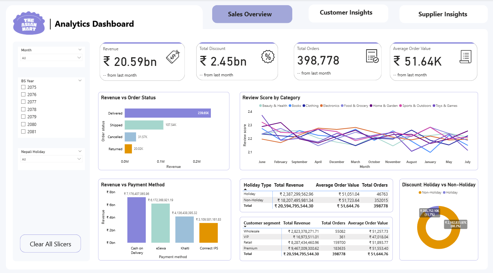
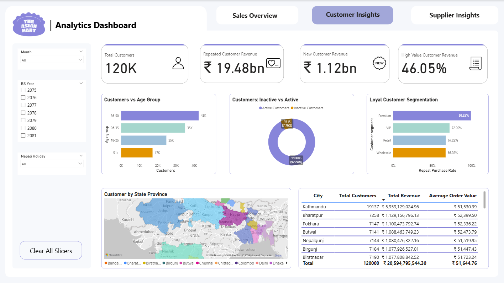
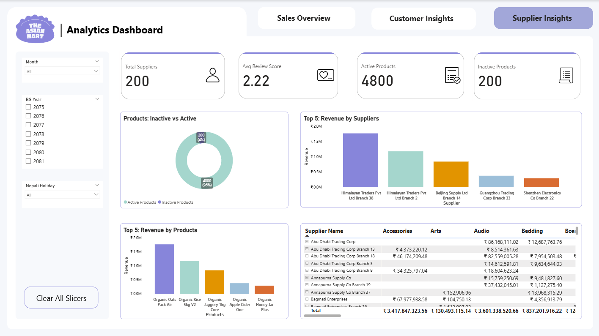

# The South Asian Mart — Analytics Dashboard

> A full-stack business intelligence solution for retail analytics, built with Microsoft's SQL Server ecosystem and Power BI.

---

## Dashboard Preview

| Sales Overview | Customer Insights | Supplier Insights |
|:-:|:-:|:-:|
|  |  |  |

---

## Project Overview

This project delivers end-to-end analytics for **The Asian Mart**, a retail business operating across major cities in Nepal. The solution covers the complete data pipeline — from raw transactional data ingestion to interactive executive dashboards.

### Key Business Questions Answered
- Who are our most loyal and high-value customers?
- Which cities generate the most revenue and repeat purchases?
- How do sales trends vary across Nepali fiscal years (BS)?
- Which suppliers and product categories drive the most value?

---

## Architecture

## Dashboard Pages

### 1. Customer Insights
| Metric | Value |
|--------|-------|
| Total Customers | 120K |
| Repeated Customer Revenue | ₹ 19.48bn |
| New Customer Revenue | ₹ 1.12bn |
| High Value Customer Revenue | 46.05% |

- **Age Group Analysis** — Largest segment: 36–50 (43K customers)
- **Active vs Inactive** — 92.24% active customers (110,685)
- **Loyal Customer Segmentation** — Premium (99.25%), VIP (72%), Retail (67.22%), Wholesale (66.92%) repeat purchase rates
- **City-wise Breakdown** — Kathmandu leads with 19,137 customers and ₹5.9bn revenue

### 2. Sales Overview
 
#### KPI Summary
| Metric | Value |
|--------|-------|
| Total Revenue | **₹ 20.59 Billion** |
| Total Discount Given | **₹ 2.45 Billion** |
| Total Orders | **398,778** |
| Average Order Value | **₹ 51.64K** |
 
#### Key Findings
 
**Revenue vs Order Status**
| Order Status | Order Count |
|-------------|-------------|
| Delivered | 239,650 |
| Shipped | 107,540 |
| Cancelled | 31,570 |
| Returned | 20,020 |
 
> **Insight:** 60% of all orders are successfully delivered. Cancelled (7.9%) and returned (5%) orders together represent a ~13% loss opportunity worth addressing through better logistics and product quality controls.
 
**Revenue vs Payment Method**
| Payment Method | Revenue |
|---------------|---------|
| Cash on Delivery | ₹ 7,176,407,065.96 |
| eSewa | ₹ 6,172,368,921.19 |
| Khalti | ₹ 4,136,438,395.32 |
| Connect IPS | ₹ 3,109,581,161.83 |
 
> **Insight:** Cash on Delivery remains the dominant payment method (34.8%), but digital wallets eSewa + Khalti combined account for nearly 49% — signaling a strong and growing shift toward digital payments in Nepal.
 
**Holiday vs Non-Holiday Sales**
| Holiday Type | Total Revenue | Avg Order Value | Total Orders |
|-------------|---------------|-----------------|-------------|
| Holiday | ₹ 2,387,299,562.96 | ₹ 51,051.04 | 46,763 |
| Non-Holiday | ₹ 18,207,495,981.34 | ₹ 51,723.64 | 352,015 |
| **Total** | **₹ 20,594,795,544.30** | **₹ 51,644.76** | **398,778** |
 
> 💡 **Insight:** Holiday orders account for 11.7% of total discounts (₹285.75M) vs 88.3% on non-holidays — suggesting discounting is spread broadly rather than concentrated around holiday promotions. Average order value is slightly *lower* on holidays, likely due to discount-driven purchases.
 
**Revenue by Customer Segment**
| Segment | Total Revenue | Total Orders | Avg Order Value |
|---------|--------------|-------------|-----------------|
| Wholesale | ₹ 2,823,378,271.71 | 55,082 | ₹ 51,257.73 |
| VIP | ₹ 16,973,511.01 | 361 | ₹ 47,018.04 |
| Retail | ₹ 8,287,434,460.96 | 159,700 | ₹ 51,893.77 |
| Premium | ₹ 9,467,009,300.62 | 183,635 | ₹ 51,553.40 |
| **Total** | **₹ 20,594,795,544.30** | **398,778** | **₹ 51,644.76** |
 
> **Insight:** **Premium** segment drives the most revenue (45.9%) and has the highest order volume (183,635). **Retail** follows as second largest (40.2%). Despite their loyalty, **VIP** customers have the lowest avg order value (₹47K) and fewest orders — worth a targeted upsell campaign.
 
**Review Score by Category** *(Trend over months)*
- All categories maintain review scores between **2.1 – 2.4** throughout the year
- No category shows significant improvement or decline over time
- Categories tracked: Beauty & Health, Books, Clothing, Electronics, Food & Grocery, Home & Garden, Sports & Outdoors, Toys & Games
> **Concern:** Consistently low review scores across all categories (avg ~2.2/5) across all months suggest a systemic issue — possibly with delivery experience, product quality, or post-purchase support — rather than a category-specific problem.
 
---

### 3. Supplier Insights

#### KPI Summary
| Metric | Value |
|--------|-------|
| Total Suppliers | **200** |
| Avg Review Score | **2.22 / 5** |
| Active Products | **4,800** |
| Inactive Products | **200** |
 
#### Key Findings
 
**Active vs Inactive Products**
- **96%** of products (4,800) are **active** — excellent inventory health
- Only **4%** (200) are inactive — minimal dead stock
  
**Top 5 Revenue by Suppliers**
| Rank | Supplier | Approx. Revenue |
|------|----------|----------------|
| 1 | Himalayan Traders Pvt Ltd Branch 38 | ~₹ 1.9M |
| 2 | Himalayan Traders Pvt Ltd Branch 2 | ~₹ 1.1M |
| 3 | Beijing Supply Ltd Branch 14 Supplier | ~₹ 0.9M |
| 4 | Guangzhou Trading Corp Branch 33 | ~₹ 0.4M |
| 5 | Shenzhen Electronics Co Branch 22 | ~₹ 0.3M |
 
> **Insight:** Himalayan Traders (local supplier) dominates revenue across branches — a positive sign for supply chain resilience, reducing over-dependency on international suppliers (Beijing, Guangzhou, Shenzhen).
 
**Top 5 Revenue by Products**
| Rank | Product |
|------|---------|
| 1 | Organic Oats Pack Air |
| 2 | Organic Rice 5kg V2 |
| 3 | Organic Jaggery 1kg Core Products |
| 4 | Organic Apple Cider One |
| 5 | Organic Honey Jar Plus |
 
> **Insight:** All top 5 revenue-generating products are **organic** — a clear signal of market demand for health-conscious products. This can guide both procurement prioritization and marketing campaigns.
 
**Concern — Low Supplier Review Score:** Average score of **2.22/5** is below acceptable thresholds. This warrants a deeper investigation into delivery times, product quality, and supplier communication at the individual supplier level.
 
**Category Revenue Snapshot**
| Category | Revenue |
|----------|---------|
| Audio | ₹ 3,601,338,520.66 |
| Accessories | ₹ 3,417,847,323.56 |
| Bedding | ₹ 837,201,916.22 |
| Arts | ₹ 130,493,115.14 |

---

## Tools & Technologies

| Layer | Tool | Purpose |
|-------|------|---------|
| ETL | **SSIS** (SQL Server Integration Services) | Data extraction, transformation & loading |
| Database | **SSMS** (SQL Server Management Studio) | Star schema design, queries, stored procedures |
| OLAP Model | **SSAS** (SQL Server Analysis Services) | Tabular model & DAX measures |
| Visualization | **Power BI Desktop** | Interactive dashboards |
| Version Control | **GitHub** | Source code management |

---

## Author

**[Erika Shrestha]**
- Email: erikashrestha333@gmail.com
- LinkedIn: https://www.linkedin.com/in/erika-shrestha/
- GitHub: https://github.com/Erika-Shrestha/

---
---
